# 社区资源本地化贡献指南

感谢你有兴趣为星露谷物语社区资源的本地化做出贡献！本指南将帮助你了解如何为 Mod、整合包和合集添加中文翻译。

## 什么是社区资源本地化

社区资源本地化是指为星露谷物语相关的 Mod、整合包（Modpack）和合集（Collection）在 Curseforge/NexusMods 上的信息添加中文翻译，让更多中文玩家能够方便地了解和使用这些资源。

## 贡献平台

我们支持对以下平台的资源进行本地化贡献：

| 平台                 | 说明                          |
| -------------------- | ----------------------------- |
| **CurseForge** | 知名的游戏 Mod 社区平台       |
| **NexusMods**  | 最大的星露谷物语 Mod 发布平台 |

## 快速贡献入口

👉 [前往本地化贡献页面](https://svl-launcher.com/contribute.html)

该页面提供了可视化的贡献界面，包含：

- 平台信息自动加载
- 中英文对照编辑
- 关系配置表格
- 实时数据预览
- 一键创建 PR

## 贡献流程

### 1. 确认资源

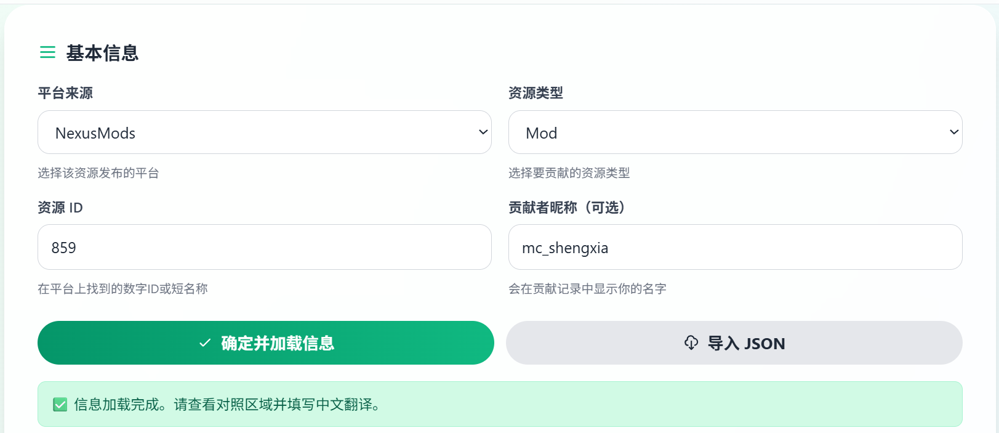

- 选择平台（NexusMods/Curseforge）和资源类型（Mod / 整合包（Modpack） / 合集（Collection））
- 填写资源 ID 或尾链（NexusMods 的 Collection 链接，如 `https://www.nexusmods.com/games/stardewvalley/collections/tckf0m`，其尾链为 ``tckf0m``）
- 可以填写你作为贡献者的昵称，在后续提交成功并并入仓库后，你会在 SVL 启动器内对应的资源下载页面看到你的大名！

  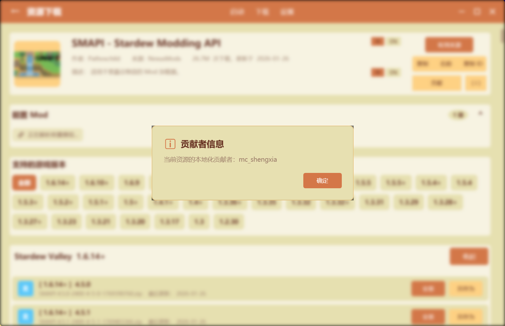
- 点击"确定并加载信息"按钮获取平台原始信息与仓库现有内容

### 2.完善内容

#### 信息对照

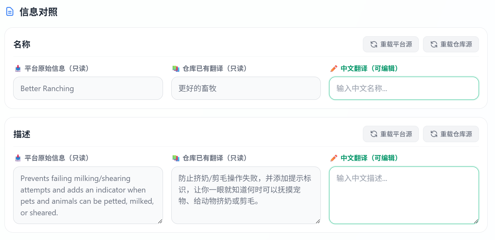

根据对照信息填写以下内容：

- **中文名称**：资源的中文译名
- **中文描述**：资源的中文简介

其中，平台原始信息是从 Curseforge/NexusMods 获取的英文信息；仓库已有翻译是目前已有的贡献成果，可以进行对照。中文翻译（可编辑）部分，就是用来输入汉化文本的地方。

#### Mod 关系配置（可选）

对于 Mod 类型的资源，你还可以配置以下关系（其中，Mod 名称可以在选择平台，输入 Mod ID 后自动补全）：

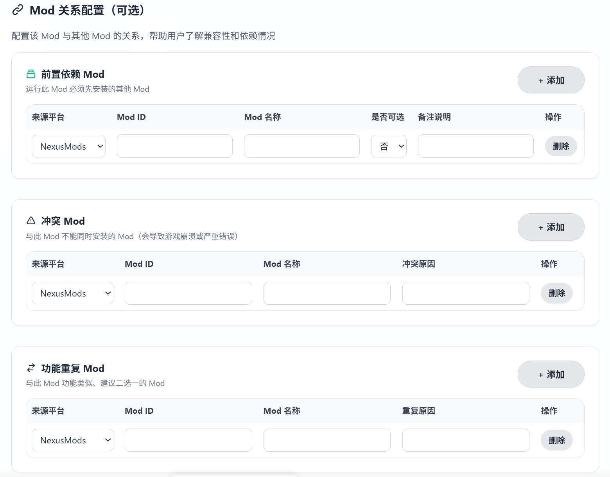

| 关系类型           | 说明                                    |
| ------------------ | --------------------------------------- |
| **前置依赖** | 运行此 Mod 必须（可选）先安装的其他 Mod |
| **冲突 Mod** | 与此 Mod 不能同时安装的 Mod             |
| **功能重复** | 与此 Mod 功能类似、建议二选一的 Mod     |

#### 附加信息

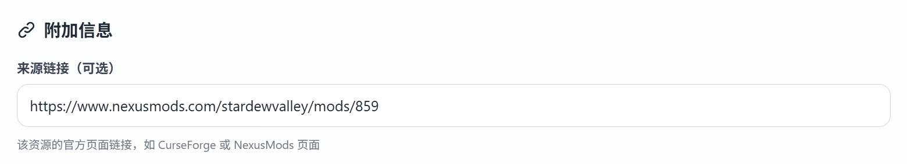

附加信息为该资源的官方页面链接，如 CurseForge 或 NexusMods 页面（一般会自动补全）

### 3. 预览并提交

#### GitHub 仓库配置

用于检查提交的目标仓库（默认为 [panda-lsy/StardewValley-Community-Localization](https://github.com/panda-lsy/StardewValley-Community-Localization)，不可更改）

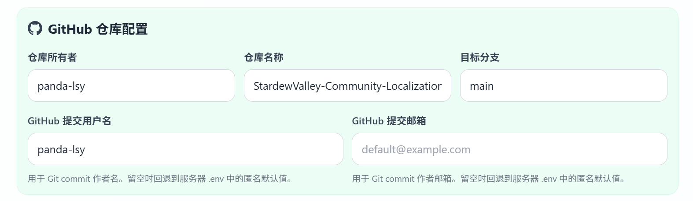

其中，GitHub 提交用户名与 GitHub 提交邮箱可以填写自己的昵称和联系邮箱（可选），也可以匿名贡献，信息会作为 PR（Pull Request）的内容一并提交，便于后续的维护者与你联系，进行汉化工作的交流。

#### 检查服务端配置状态

一般后端的 GitHub PR 提交机器人是可以连接的。如果出现问题，请联系[维护者](mailto:shengxia23@hainnu.edu.cn)。

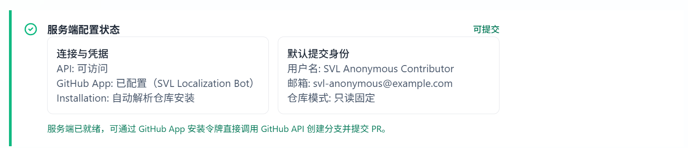

#### 对数据进行预览

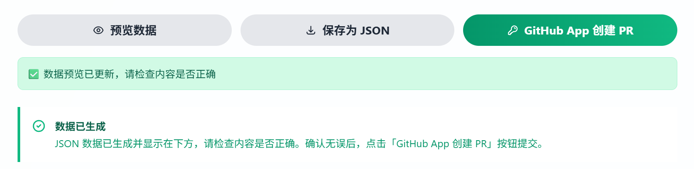

通过表单填写的数据会自动生成为 `.json` 文件，用于规范化存储。

- 点击「预览数据」预览生成的 JSON 数据，可以进行检查（若仓库已有 JSON 数据，可以进行对照检查）：

  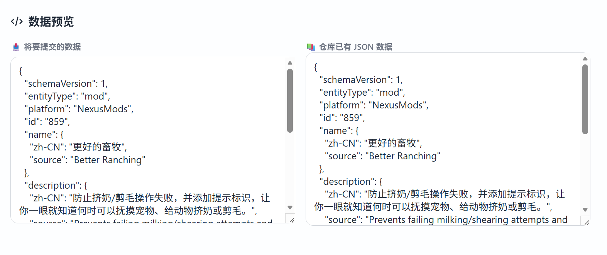

  - `zh-CN` 字段是否正确规范；
  - 若填写贡献者昵称， `contributor` 字段是否保留你的信息；
- 确认无误后可以「保存为 JSON 」储存到本地作为草稿，后续重新导入编辑；或者点击「 GitHub App 创建 PR」，将汉化成果贡献到仓库。

#### 恭喜提交！

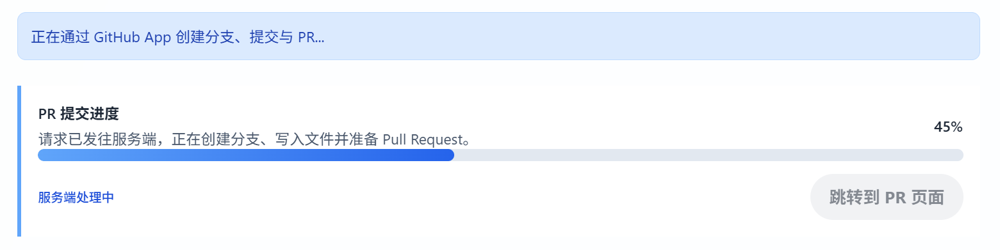

当点击「 GitHub App 创建 PR」后，后端会自动将生成的 JSON 文件进行处理，然后交给 SVL 机器人（SVL-Bot）自动代提交。
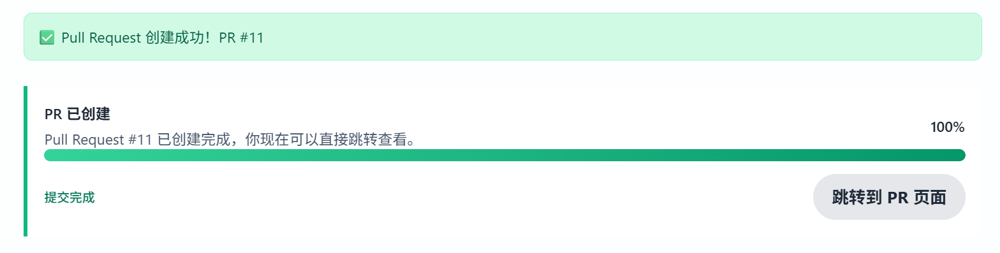

当生成完毕后，可以「跳转到 PR 页面 」查看你刚刚提交的汉化成果（可能需要科学上网）。

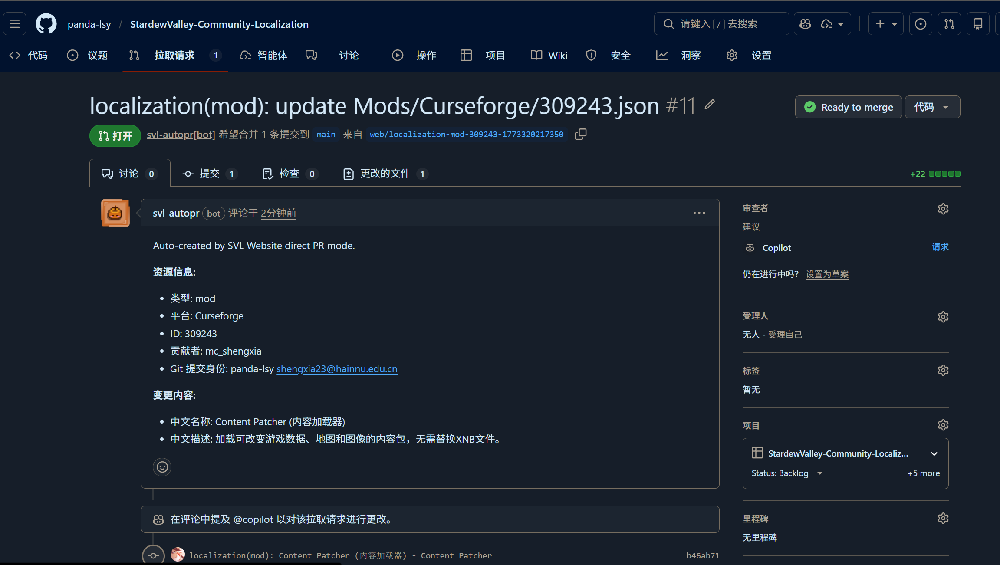

这样就代表着已经将成果提交，只需要等待维护者审核并并入仓库，就完成了！

## 数据格式说明

提交的数据将保存为 JSON 格式，包含以下字段：

```json
{
  "id": "资源ID",
  "platform": "Curseforge|NexusMods",
  "type": "mod|modpack|collection",
  "name": {
    "original": "原始英文名称",
    "zh": "中文名称"
  },
  "description": {
    "original": "原始英文描述",
    "zh": "中文描述"
  },
  "sourceUrl": "官方页面链接",
  "dependencies": [...],
  "conflicts": [...],
  "overlaps": [...],
  "contributor": "贡献者昵称"
}
```

## 贡献规范

### 命名规范

- 中文名称应简洁明了，准确反映资源功能
- 优先使用社区通用译名
- 避免使用过于口语化或网络用语

### 描述规范

- 描述应准确概括资源的主要功能
- 可以适当补充使用说明或注意事项
- 保持客观中立，避免过度宣传

### 关系配置规范

- 前置依赖：必须准确，注明是否为可选
- 冲突 Mod：必须有明确证据，说明冲突原因
- 功能重复：应客观比较，帮助用户做出选择

## 贡献记录

所有贡献者将在以下位置被记录：

- 提交记录（Git Commit）
- Pull Request 描述
- 资源元数据中的 `contributor` 字段

## 获取帮助

如果你在贡献过程中遇到问题，可以通过以下方式获取帮助：

- 在 [GitHub Issues](https://github.com/panda-lsy/SVL-Wiki/issues) 中提问
- 在 Pull Request 中 @ 维护者寻求帮助
- 查看已有的本地化贡献示例

## 返回

← [返回贡献指南](./Contributing)

## 相关仓库

本地化数据将提交到以下仓库：

📦 [StardewValley-Community-Localization](https://github.com/panda-lsy/StardewValley-Community-Localization)

该仓库专门用于存储星露谷物语社区资源的本地化数据，与 SVL 启动器配合使用。
