# 创建游戏实例

本指南详细介绍如何创建和管理游戏实例，以及 SMAPI 的安装。

## 📋 目录

- [什么是实例？](#什么是实例)
- [创建新实例](#创建新实例)
- [安装 SMAPI](#安装-smapi)
- [实例设置](#实例设置)
- [克隆实例](#克隆实例)
- [删除实例](#删除实例)

## 什么是实例？

实例是一个独立的游戏环境，拥有：

- **独立的 Mod 列表** - 每个实例可以安装不同的 Mod
- **独立的配置** - 游戏设置可以不同
- **共享的存档** - 所有实例共用同一存档目录

> **注意**：当前版本中，所有实例共享存档目录。这意味着不同实例之间可以访问相同的游戏存档。

### 使用场景

| 场景                  | 说明                                 |
| --------------------- | ------------------------------------ |
| **多 Mod 配置** | 一个实例玩农场 Mod，另一个玩冒险 Mod |
| **版本测试**    | 测试新 Mod 不影响主力配置            |
| **整合包管理**  | 每个整合包使用独立实例               |

## 创建新实例

SVL 提供多种创建实例的方式，你可以根据需求选择合适的方法。

### 方法一：创建实例时安装 SMAPI

在创建实例时直接安装 SMAPI，一步到位。SVL 提供三个源的 SMAPI 安装支持

| 来源         | Github             | Curseforge | NexusMods                           |
| ------------ | ------------------ | ---------- | ----------------------------------- |
| 是否需要登录 | ❌                 | ✅         | ✅                                  |
| 优势         | 无需登录，版本齐全 | 下载速度快 | 版本齐全                            |
| 劣势         | 网速受限           | 版本不全   | 网速受限，需要 premium 才能自动下载 |

#### 步骤

1. 点击导航栏的 **「下载」** 按钮
2. 选择对应的源然后点击 **「查看详情」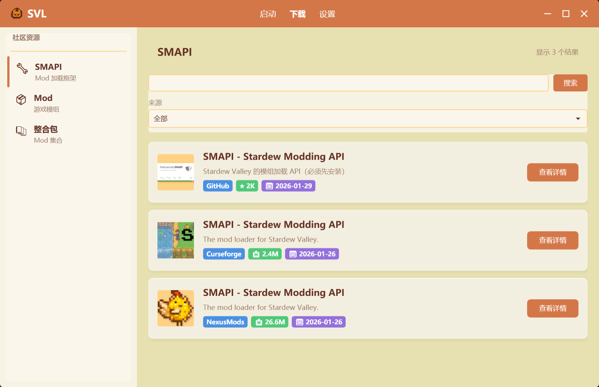**
3. 根据支持的游戏版本在对应的 SMAPI 版本下点击 **「安装」**
4. 此时会自动使用用户设置的游戏路径，也可以自行重新选择，然后点击 **「使用此路径」**
5. 输入实例的名称（版本名）然后点击 **「确定」**
6. SVL 会自动创建实例并安装 SMAPI

### 方法二：从整合包导入

如果你有整合包文件，可以直接导入创建实例。

#### 支持的整合包格式

- **SVL 格式** - `.zip`文件
- **通用格式** - `.zip` 文件（包含 `manifest.json`）
- **CurseForge 格式** - `.cfmodpack` 文件（从 CurseForge 导出的整合包）

#### 导入步骤（A）

1. 点击主页左侧的 **「版本选择」** 按钮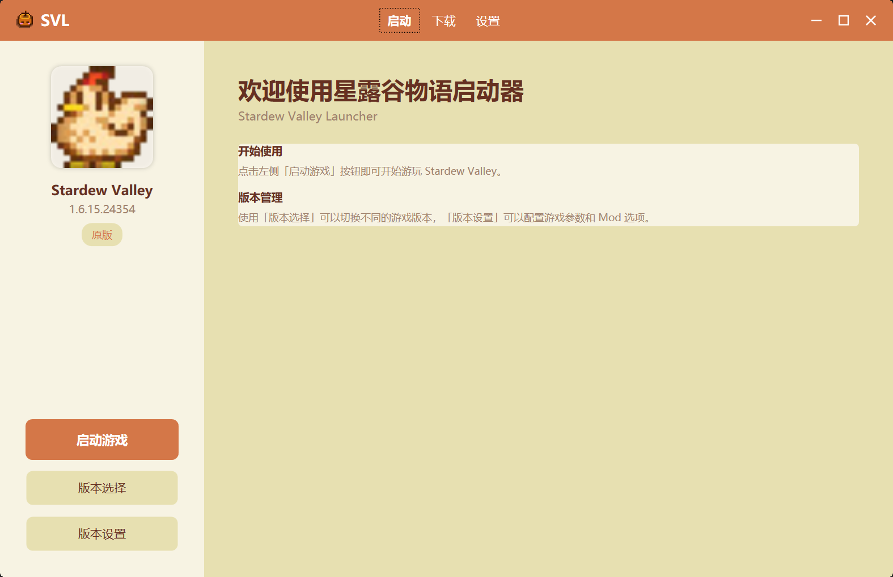
2. 选择 **「导入整合包」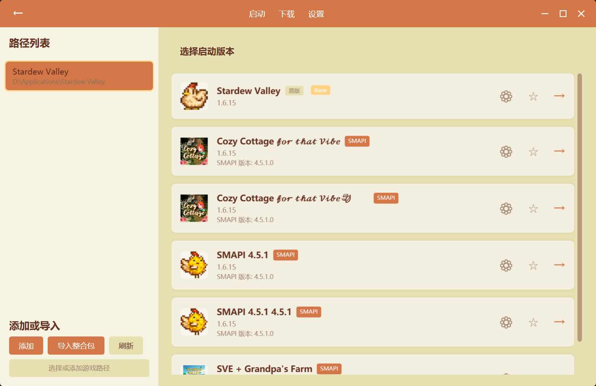**

#### 导入步骤（B）

1. 选择整合包文件（`.svlpack`、`.zip` 等），并直接拖入启动器窗口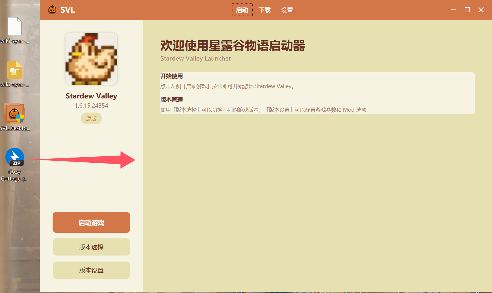

#### 开始安装

1. 选择游戏路径，点击 **「开始安装」**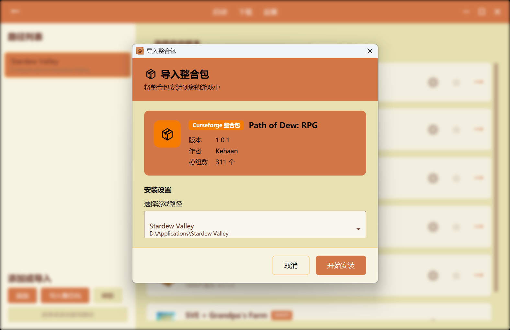
2. 填写实例名称，点击 **「确定」**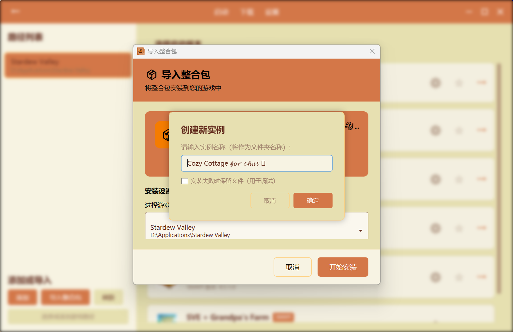
3. 等待 SVL 自动：

   - 解压整合包
   - 安装所有 Mod
   - 安装指定版本的 SMAPI
   - 配置实例设置

#### 方法三：从 SVL 下载并安装整合包

1. 点击 **「下载」**
2. 点击 **「整合包」**，当配置好 Curseforge 的 API 与 NexusMods 的登陆后，SVL 会提供两种来源的整合包，也可以自行进行搜索，选中后进行点击。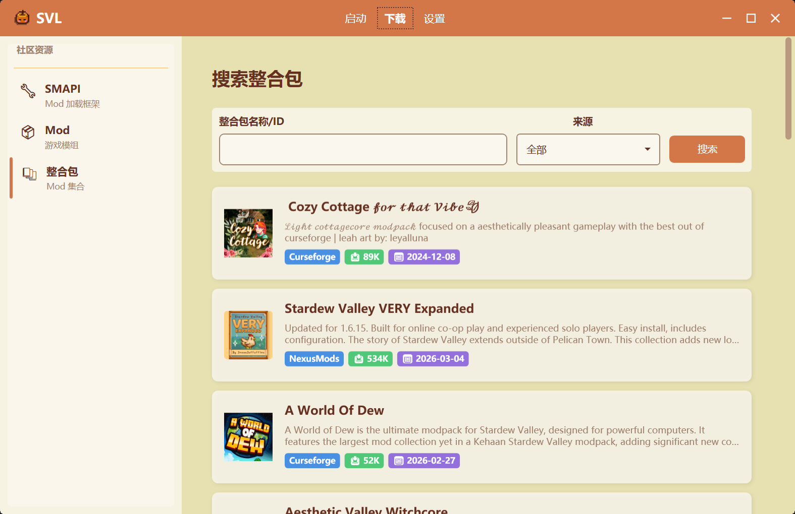
3. 之后点击 **「安装」** 按钮，在进行确认游戏路径以及输入实例名称后，即可对整合包一键进行安装。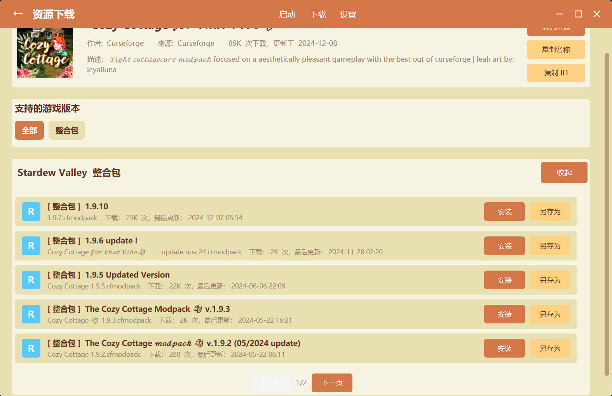

## 安装 SMAPI

SMAPI（Stardew Modding API）是星露谷物语的 Mod 加载器，所有 Mod 都需要 SMAPI 才能运行。

### 方式一：使用 SVL 自动安装

**推荐** - 最简单的方式。

参考 [方法一:创建实例时安装 SMAPI](#方法一：创建实例时安装 SMAPI)

### 方式二：手动安装/更改版本到现有实例

如果实例已经创建，可以手动安装 SMAPI，或者对现有的 SMAPI  版本进行修改。

#### 步骤

1. 在主页面点击 **「版本选择」**，如果主页面的版本为你选择的版本，则直接点击 **「版本设置」**
2. 选中需要修改的版本的 **「⚙（设置图标）」** ，进入版本设置页面
3. 点击 **「自动安装」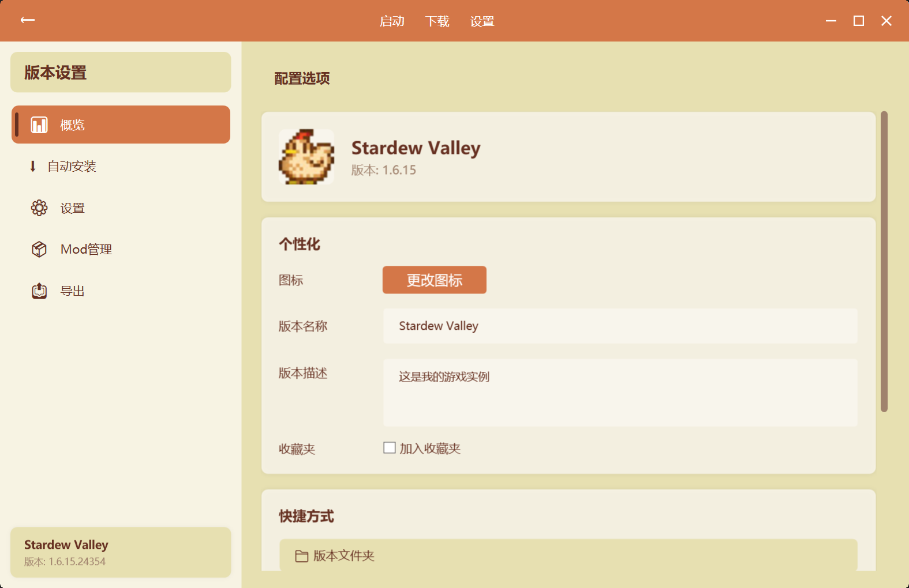**
4. 点击 **「安装/更改 SMAPI」**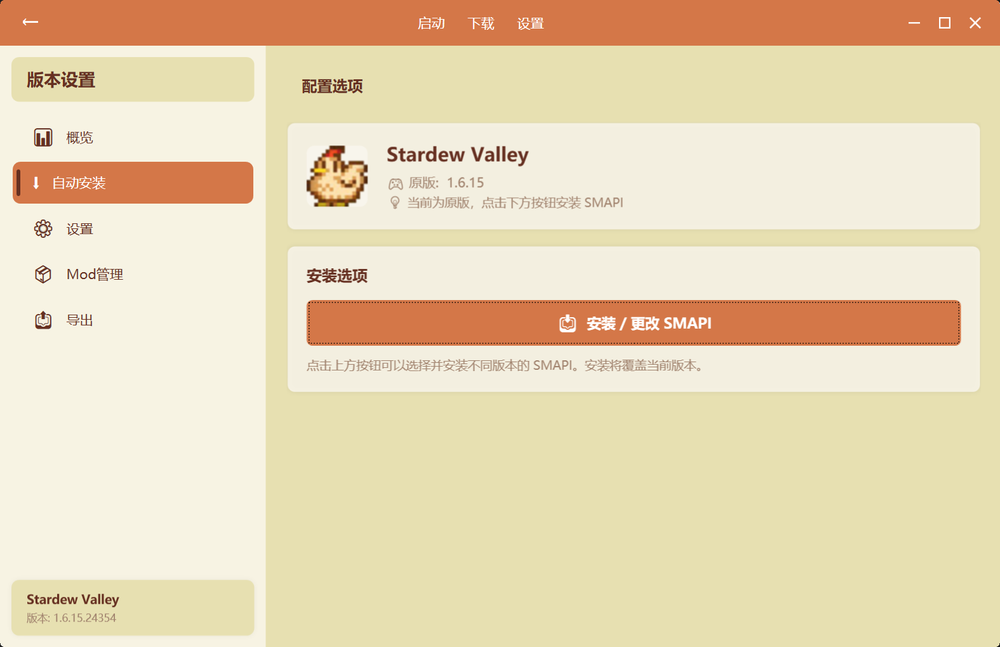
5. 选择版本并点击 **「安装」**：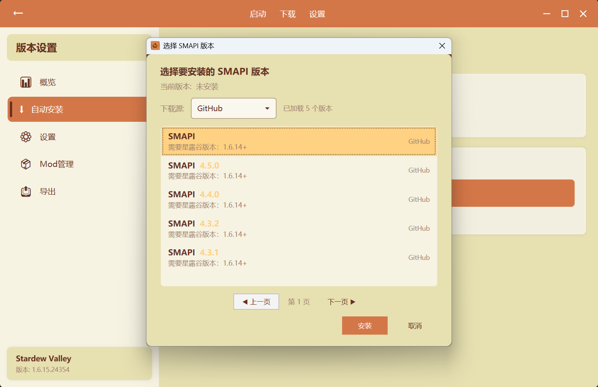
6. 等待下载和安装完成

### 方式三：从整合包安装

导入整合包时会自动安装指定版本的 SMAPI。

### 常见问题

#### SMAPI 安装失败

**原因：**

- 网络连接问题
- 游戏路径不正确
- 权限不足

**解决方法：**

1. 检查游戏路径是否正确
2. 以管理员身份运行 SVL
3. 检查网络连接
4. 尝试手动下载 SMAPI 并指定本地路径

#### 版本兼容性

- 确保 SMAPI 版本与游戏版本兼容
- 某些 Mod 可能需要特定版本的 SMAPI
- 查看 Mod 页面的兼容性说明

#### 多个 SMAPI 版本

SVL 支持每个实例使用不同的 SMAPI 版本：

- 实例 A 可以使用 SMAPI 3.18.0
- 实例 B 可以使用 SMAPI 4.0.0
- 版本之间完全隔离

## 实例设置

进入实例（版本设置页面）后，可以配置以下选项：

### 概览

- 查看实例基本信息
- 修改在启动器显示的图标、显示名称、描述、是否加入收藏夹
- 一键打开版本文件夹、存档文件夹
- 删除版本

### 自动安装

- 安装/修改 SMAPI 版本

### 设置

| 设置                   | 说明                                     |
| ---------------------- | ---------------------------------------- |
| **版本隔离**     | 是否开启版本隔离（WIP）                  |
| **窗口标题**     | 修改游戏启动后显示的标题                 |
| **启动参数**     | 修改游戏的启动参数（WIP）                |
| **自动进入**     | 启动时自动进入服务器（WIP）              |
| **服务器地址**   | 自动连接到服务器的 IP 地址（WIP）        |
| **Steam 邀请码** | 自动进入到 Steam 多人联机的邀请码（WIP） |

### Mod 管理

- 查看所有已安装 Mod
- 打开 Mods 文件夹
- 检测 Mod 更新
- 跳转到 Mod 下载页面
- 启用/禁用 Mod
- 查看 Mod 详情

### 导出

- 导出为整合包
- 分享给其他玩家

## 删除实例

### 步骤

1. 右键点击实例卡片
2. 选择 **「删除实例」**
3. 确认删除

### 注意事项

> ⚠️ **警告**：删除实例会删除：
>
> - 实例配置
> - Mods 文件夹
> - 隔离的存档数据

> ✅ 原版游戏文件不会被删除

### 保留数据

如果只想从列表移除但保留文件：

1. 进入实例设置 → **「设置」**
2. 点击 **「从列表移除」**
3. 选择是否保留文件

---

## 相关文档

- [版本隔离](../features/Version-Isolation)
- [Mod 管理](../features/Mod-Management)
- [Modpack 整合包](../features/Modpack-Support)
