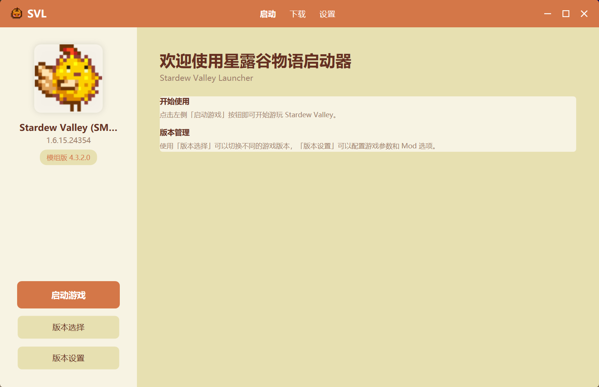
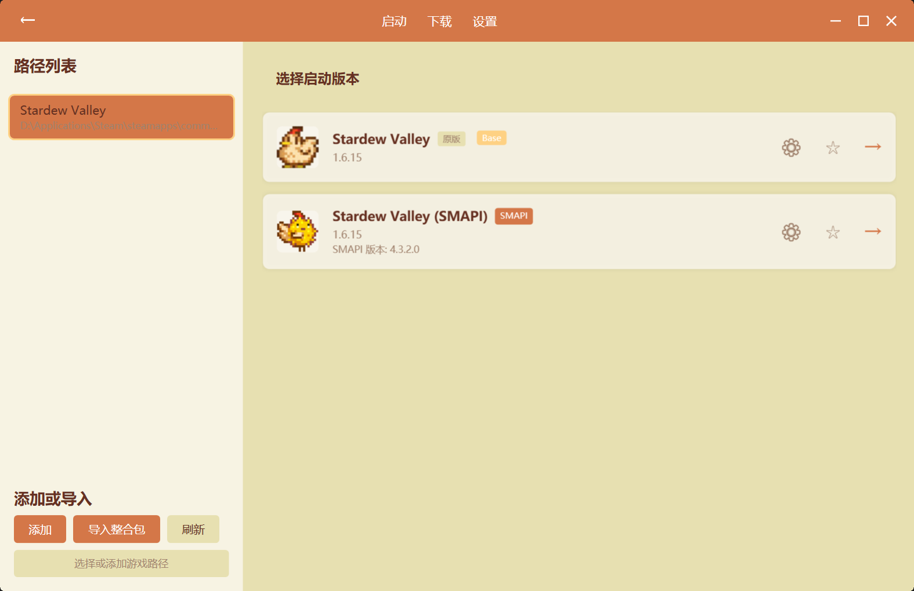
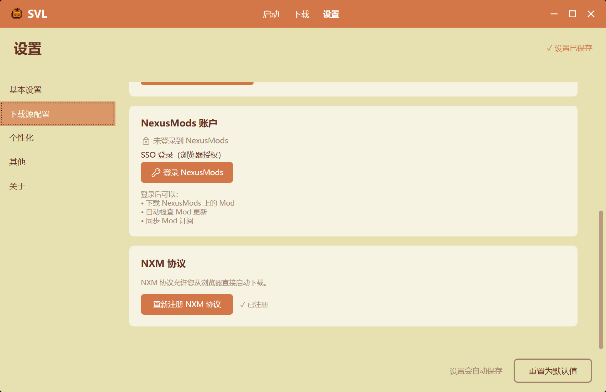
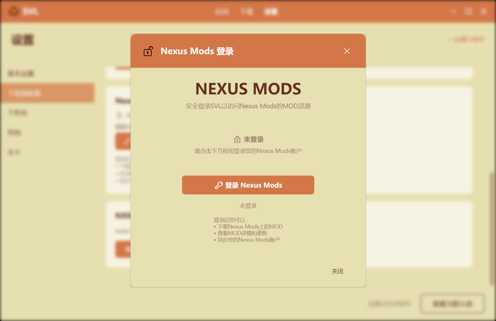
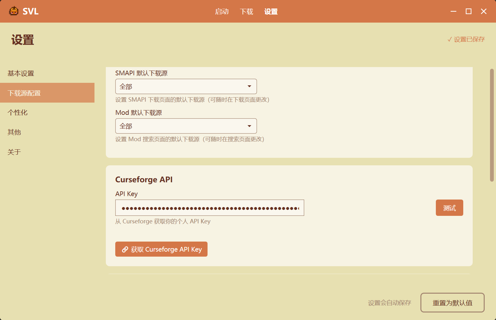

# 初次使用

本指南帮助你快速上手 SVL 启动器。

## 📋 目录

- [界面概览](#界面概览)
- [设置游戏路径](#设置游戏路径)
- [配置 Mod 下载源](#配置-mod-下载源)
- [启动游戏](#启动游戏)

## 界面概览

SVL 的主界面分为几个部分：

* 顶部导航栏
* 主页面
  * 左侧栏
  * 右侧栏



### 顶部导航栏

| 文字 | 页面     | 功能                               |
| ---- | -------- | ---------------------------------- |
| SVL  | 无       | 启动器标题，可在设置自定义         |
| 启动 | 主页面   | 管理和启动游戏实例                 |
| 下载 | 下载页面 | 下载社区资源（SMAPI、Mod、整合包） |
| 设置 | 设置页面 | 对启动器进行全局设置               |

## 设置游戏路径

### 自动检测

首次运行时，SVL 会尝试自动检测游戏路径：

- **Steam**: `Steam\steamapps\common\Stardew Valley`
- **GOG**: `GOG Galaxy\Games\Stardew Valley`

### 手动设置

如果自动检测失败，可以手动选择游戏路径：

1. 进入 **「启动 (主页面)」** → **「版本选择」**
2. 点击 **「添加或导入」** 下方的 **「添加」**
3. 找到 Stardew Valley 安装目录（可在文件夹右侧的输入框直接粘贴绝对路径）
4. 选择包含 `Stardew Valley.exe` 的文件夹
5. 点击 **「确定」**

### 验证路径

正确的游戏目录应包含：

```
Stardew Valley/
├── Stardew Valley.exe
├── Stardew Valley.dll
├── Content/
└── ...
```

## 配置下载源

SVL 支持从多个 Mod 社区下载 Mod、SMAPI 与整合包，包括 **Nexus Mods** 和 **CurseForge**。配置这些下载源可以让你直接在启动器中搜索、浏览和下载 Mod。

### Nexus Mods

[Nexus Mods](https://www.nexusmods.com/) 是最大的游戏 Mod 社区之一，拥有丰富的星露谷物语 Mod 资源。

#### 特点

- 📚 Mod 资源丰富，更新活跃
- 🔍 强大的搜索和分类功能
- ⭐ Mod 评分和评论系统
- 🔄 支持 Mod 更新追踪

#### 配置步骤

1. 进入 **「设置」** → **「下载源配置」** → **「登录 NexusMods」**
2. 点击 **「登录 NexusMods」** 按钮
3. 使用浏览器完成 OAuth 授权
4. 授权成功后自动返回 SVL

> **提示**：登录后可以直接从 NexusMods 网站一键下载 Mod（需关联 NXM 协议）。

### CurseForge

[CurseForge](https://www.curseforge.com/) 是另一个流行的 Mod 托管平台，同样提供了大量的星露谷物语 Mod。

#### 特点

- 🎮 整合包资源丰富
- 📦 支持 Modpack 导入
- 🌐 社区活跃
- 📊 Mod 统计信息详细

#### 配置步骤

1. 进入 **「设置」** → **「下载源配置」**
2. 如有账号，直接点击[获取 Curseforge API Key](https://console.curseforge.com/?#/api-keys)
3. 将获取到的 API Key 填入输入框，并点击测试。正常会返回 "API Key 有效"

### 下载源对比

| 特性                 | Nexus Mods   | CurseForge |
| -------------------- | ------------ | ---------- |
| **Mod 数量**   | 丰富         | 良好       |
| **需要登录**   | 是           | 是         |
| **整合包支持** | ✅           | ✅         |
| **一键下载**   | 需要 Premium | ✅         |
| **更新追踪**   | ✅           | ✅         |

> **建议**：同时配置两个下载源，以获得更全面的 Mod 资源访问。

## 启动游戏

### 启动方式

1. 在版本选择找到你的实例卡片
2. 点击切换，并返回到主界面。
3. 点击 **「启动游戏」** 按钮

### 启动模式

| 模式               | 说明                                |
| ------------------ | ----------------------------------- |
| **Mod 模式** | 通过 SMAPI 启动，加载所有启用的 Mod |
| **原版模式** | 直接启动游戏，不加载 Mod            |

### 首次启动

首次启动时，SMAPI 会：

- 显示控制台窗口
- 加载所有 Mod
- 输出加载日志

如果一切正常，游戏会正常启动并显示 SMAPI 版本信息。

---

## 下一步

- [创建游戏实例](./Creating-Instance) - 学习如何创建和管理实例
- [安装 Mod](./Installing-Mods) - 学习如何安装和管理 Mod
- [创建整合包](../features/Modpack-Support)
