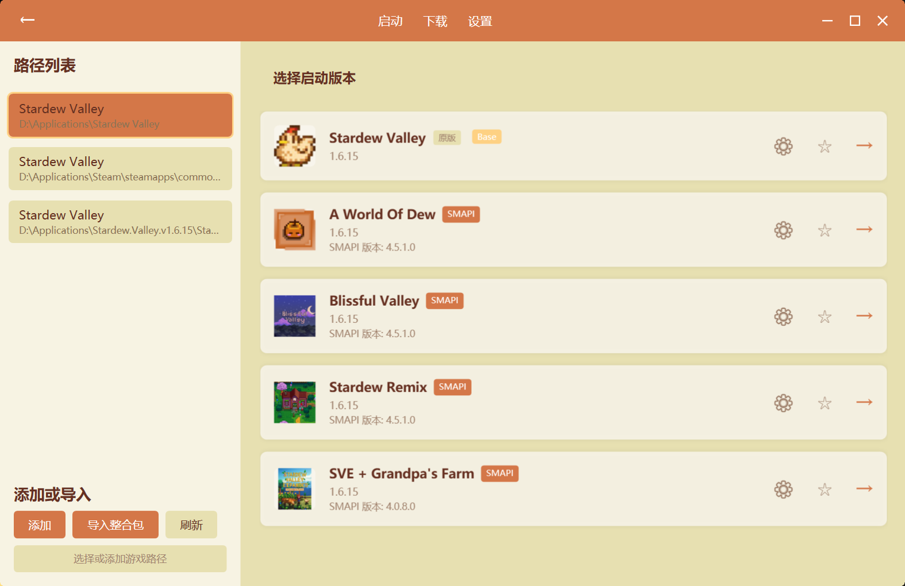
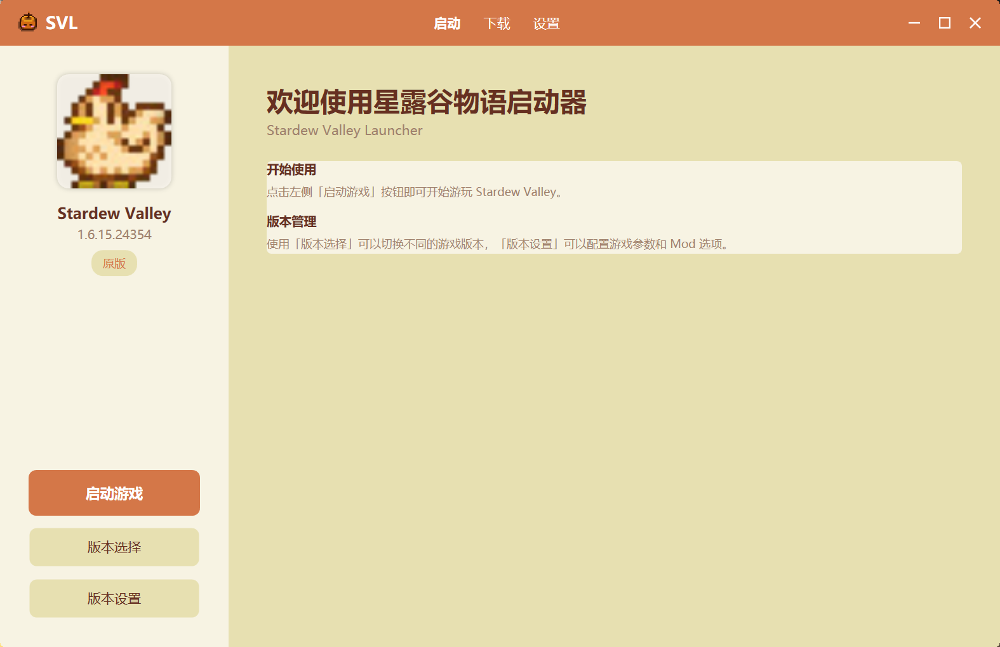
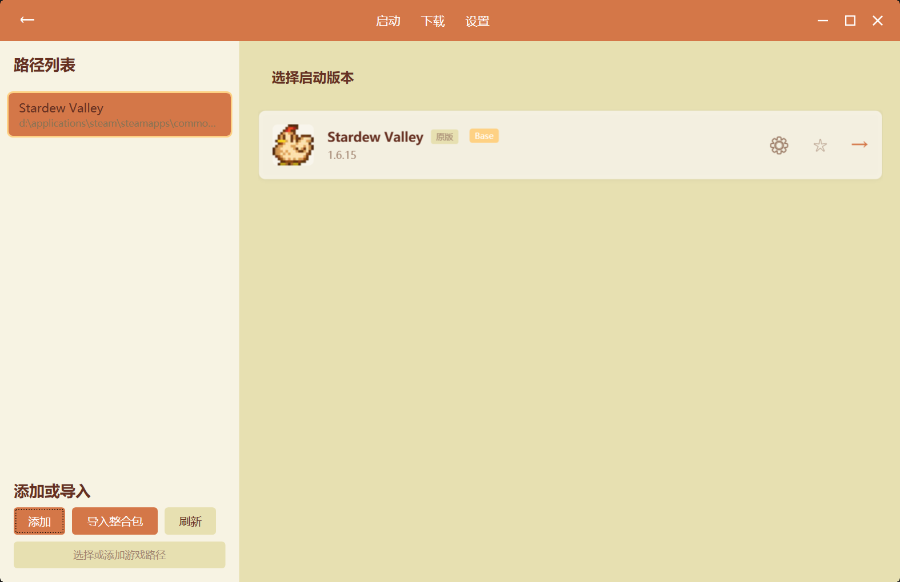
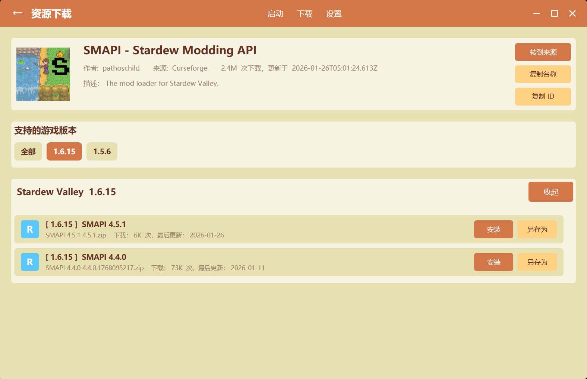
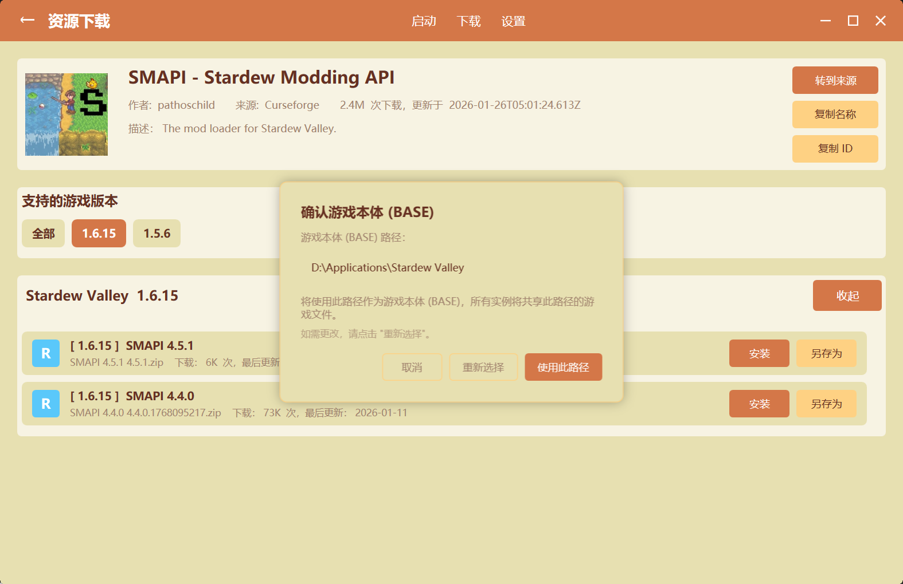
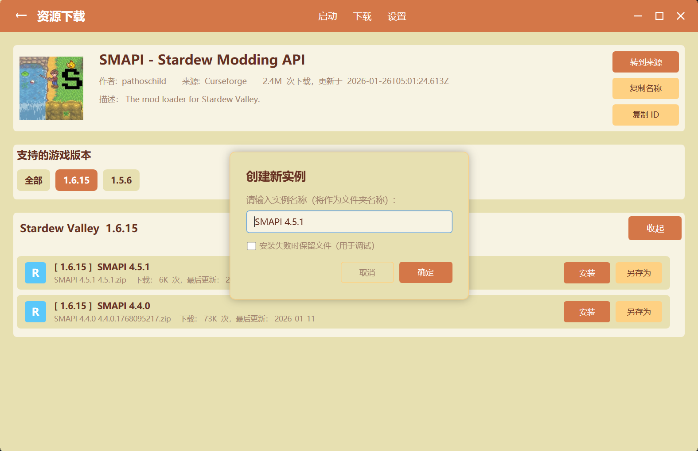
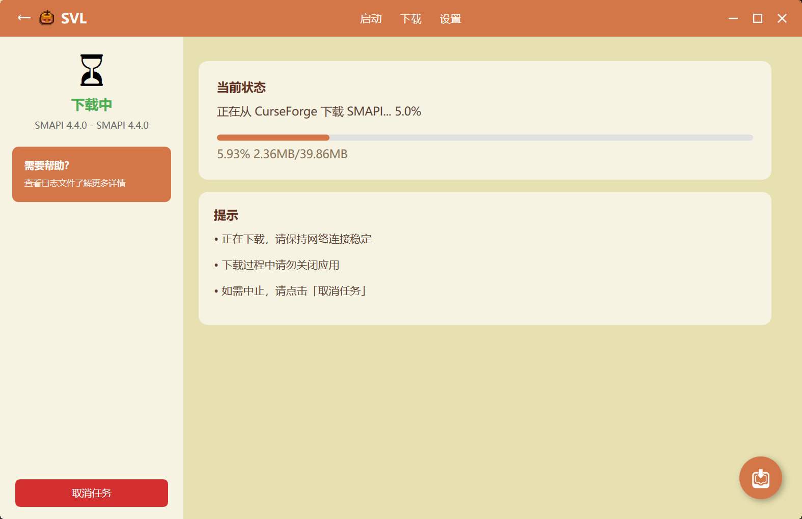
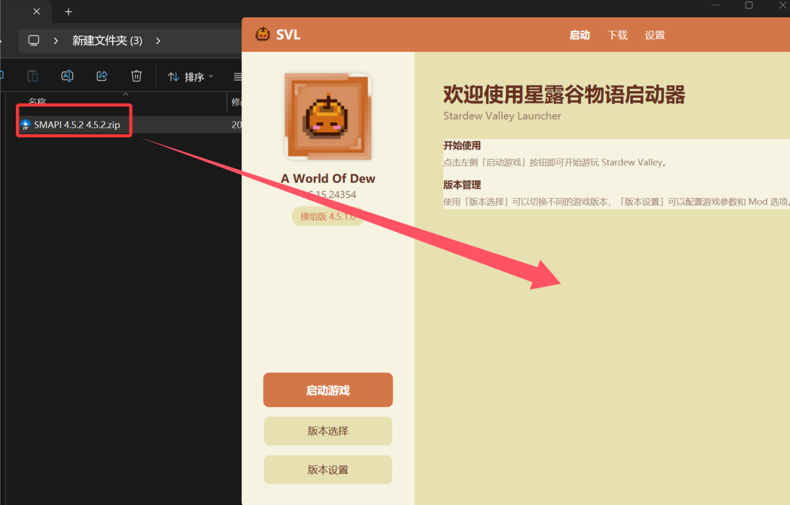
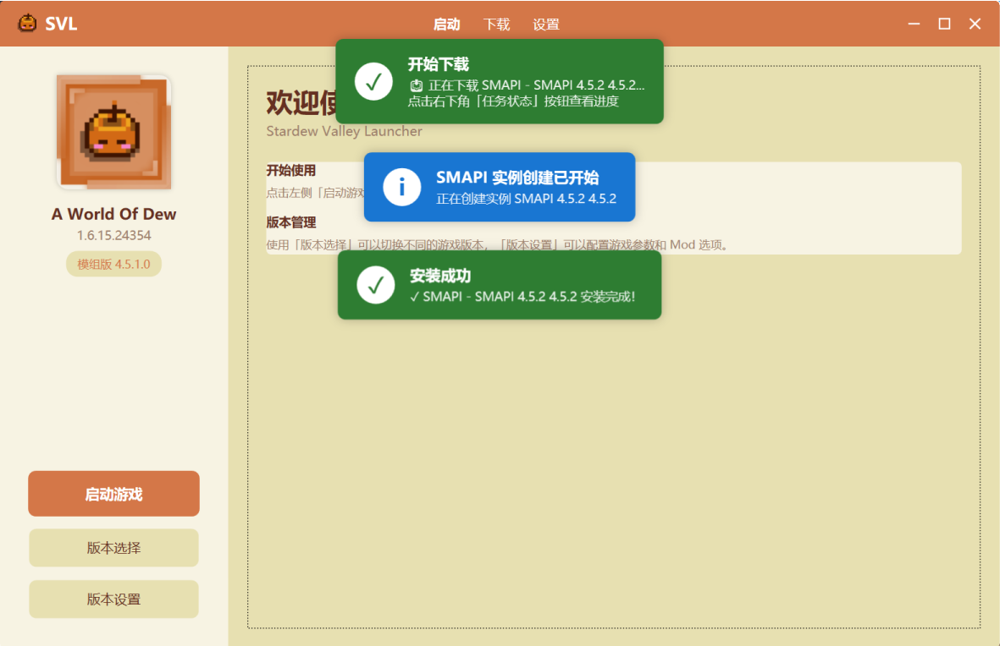
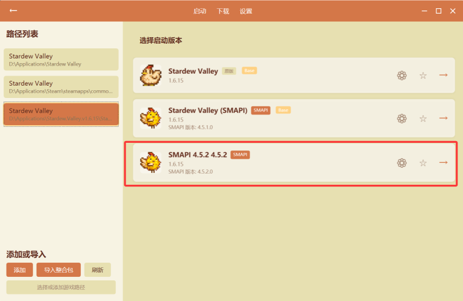

# 初次使用

> 欢迎使用 SVL（Stardew Valley Launcher）！如果你是第一次接触这个启动器，本章节将会快速教会你如何添加星露谷物语作为 Base 到启动器，以及创建你的第一个**版本隔离的** SMAPI 游戏实例。

## 小科普

**什么是 Base？**

**Base** 指的是通过 **传统的游戏安装方式** 安装的星露谷物语（以及 SMAPI）所在的安装文件夹（例如 Steam 默认的 `...\Steam\steamapps\common\Stardew Valley`）。

**什么是游戏实例？**

**实例** 是 SVL  **最核心的创新** ，它让你拥有多个完全独立的游戏环境。

* 拥有自己独立的  **Mods 文件夹** 和 SMAPI 版本。
* 共享同一份游戏本体文件（避免重复占用硬盘空间）。

> 注：版本隔离的实例不同于传统的 Mod 组合，前者对整合包系统适配性更佳。你可以在一个《星露谷物语》下，通过更加系统的管理方式来共存许多整合包。
>
> 这些 Modpacks 使用的都是同一个游戏本体！但是可以随意切换。

## 添加你的 Base 文件夹

启动器进行版本隔离管理的基础是需要一个安装好的《星露谷物语》，它会基于这个作为 Base，然后进行游戏实例的管理与启动。

当你第一次打开 SVL，它会自动检测你现有的 Base 游戏目录（例如 Steam 安装的 Stardew Valley）。

如果并没有自动检测到 Base，或者你的游戏安装到其他文件夹的话，可以手动添加到版本列表中：

在主页面点击「版本选择」，然后在版本选择页面的左下角，点击「添加」按钮，之后选择游戏所在的文件夹就可以了

（注意：文件夹输入框可以复制路径进去并自动进行解析，可以先在文件管理器找到游戏的位置，然后一键复制游戏路径过去）

## 创建第一个游戏实例

通过在启动器里 **安装一个新的 SMAPI** （或者直接把 SMAPI 的压缩包拖进去），它就会自动引导你 **创建一个新的游戏实例** 。

### 下载 SMAPI

SVL 提供三个源的 SMAPI 自动化安装支持

| 来源 | Github   | Curseforge | NexusMods                           |
| ---- | -------- | ---------- | ----------------------------------- |
| 登录 | 无需登录 | 需要登录   | 需要登录                            |
| 优势 | 版本齐全 | 下载速度快 | 版本齐全                            |
| 劣势 | 网速受限 | 版本不全   | 网速受限，需要 premium 才能自动下载 |

点击导航栏的 **「下载」** 按钮，选择对应的源然后点击 **「查看详情」**，以跳转到安装页面

根据支持的游戏版本在对应的 SMAPI 版本下点击 **「安装」**

此时需要确认游戏本体，确认完毕后点击 **「使用此路径」** ，启动器将会创建使用此文件夹下游戏资源的 游戏实例。

输入实例的名称（版本名字）然后点击 **「确定」**

SVL 会自动创建实例并安装 SMAPI，此时右下角会浮现 **「任务管理器」** 按钮，点击即可查看当前的任务状态。

### 从本地的 SMAPI ZIP 文件导入安装

选择整合包文件（`.svlpack`、`.zip` 等），并直接拖入启动器窗口。其余操作同上。

### 检测是否成功安装

提示 **安装完成** 后，点击**「版本选择」**

在这里就能发现新的游戏实例

## 下一步

- [创建游戏实例](./Creating-Instance) - 学习如何创建和管理实例
- [安装 Mod](./Installing-Mods) - 学习如何安装和管理 Mod
- [创建整合包](../features/Modpack-Support)
